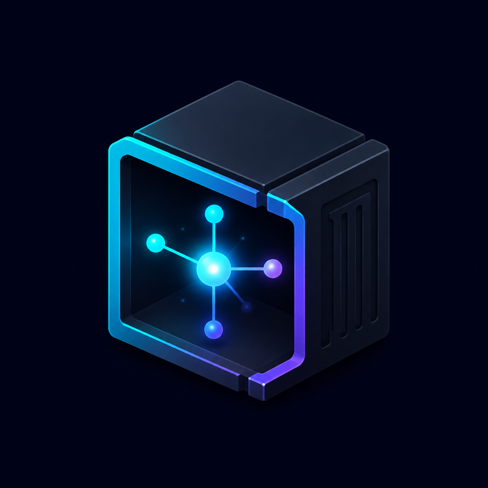

  

<h1 align="center">agent-box</h1>

  <strong>Give coding agents the environment they need—while limiting persistent writes to the selected repository.</strong>

  
  
  
  

  <a href="#quick-start">Quick start</a> ·
  <a href="#how-it-works">How it works</a> ·
  <a href="#command-line-reference">CLI</a> ·
  <a href="SECURITY.md">Security model</a> ·
  <a href="CONTRIBUTING.md">Contributing</a>

---

`agent-box` runs an interactive shell or coding agent inside a [Bubblewrap](https://github.com/containers/bubblewrap) sandbox while preserving your real Linux toolchain and exact absolute paths.

Your host filesystem remains visible but read-only. One selected repository is mounted read/write at its original path, while writes elsewhere in your home directory land in a disposable copy-on-write overlay. Existing Git identity, language runtimes, package caches, virtual environments, and agent configuration remain immediately available.

This lets you safely try session-specific agent configuration. For example, you can edit Claude Code's default settings at `~/.claude/settings.json` from inside `agent-box`; the agent sees the changed settings for that session, but the host file is unchanged and the edits are discarded when `agent-box` exits.

> [!IMPORTANT]
> `agent-box` is primarily a **host write-isolation tool**, not a confidentiality boundary. Sandboxed programs can read files and credentials your Unix account can read. Network access is shared by default. Read the [security model](SECURITY.md) before using it with untrusted code.

## Why agent-box?

Containers are excellent isolation tools, but they usually introduce a new filesystem layout and a second development environment. That is awkward when a project already depends on path-sensitive state such as:

~~~text
/home/user/projects/app/.venv/bin/python
~~~

Inside `agent-box`, that path stays exactly the same. The repository's virtual environments, `node_modules`, Rust targets, build trees, and other local state continue to work without rebuilding an image.

| Capability | Default behavior |
|---|---|
| Host filesystem | Read-only |
| Selected repository | Read/write at the same absolute path |
| Home directory | Existing files readable; new writes disposable |
| `/tmp` and `/run` | Private |
| Network | Shared; disable with `--offline` |
| Git safety snapshot | Enabled |
| Git push | Blocked; enable with `--allow-git-push` |
| Runtime footprint | Shell, Git, Bubblewrap, and Python's standard library only |

## Quick start

### 1. Install the requirements

- Linux with unprivileged user namespaces
- Bash 4.4 or newer
- Bubblewrap 0.12.0 or newer
- Git 2.x
- Python 3.9 or newer
- `realpath`

Bubblewrap releases before 0.12.0 are rejected because they are affected by [GHSA-pxhw-h44j-8pfx](https://github.com/containers/bubblewrap/security/advisories/GHSA-pxhw-h44j-8pfx). See the [Bubblewrap installation guide](docs/installing-bubblewrap.md) if your distribution does not provide a new enough version.

### 2. Clone and check the system

~~~bash
git clone https://github.com/abraxarion/agent-box.git
cd agent-box
./scripts/check-system.sh
~~~

### 3. Open a sandboxed shell

~~~bash
./agent-box ~/projects/my-project
~~~

The Bash prompt is marked with a box so it is easy to see when you are inside the sandbox. Start your preferred coding agent from that shell:

~~~bash
codex
# or: claude
# or: pi
~~~

To launch Claude Code directly:

~~~bash
./agent-box --claude ~/projects/my-project
~~~

## Installation

Running directly from the checkout is fully supported:

~~~bash
./agent-box /path/to/repository
~~~

To install for the current user:

~~~bash
./scripts/install.sh
~~~

This creates:

~~~text
~/.local/bin/agent-box
~/.local/lib/agent-box/
~~~

Ensure `~/.local/bin` is in `PATH`, then run `agent-box` from anywhere.

Use a custom prefix when needed:

~~~bash
PREFIX=/opt/agent-box ./scripts/install.sh
~~~

## How it works

~~~text
HOST                                             SANDBOX

/                              ───────────────►  /             read-only
$HOME                          ───────────────►  $HOME         disposable COW
$REPOSITORY                    ───────────────►  same path     read/write
host Git metadata snapshot     stays outside    host-side ZIP
/tmp                                             private tmpfs
/run                                             private tmpfs
/proc                                            private procfs
/dev                                             private device view
~~~

The order of the mounts is part of the security design:

1. Mount the host root read-only.
2. Layer a disposable writable overlay over `$HOME`.
3. Replace `/tmp` and `/run` with private filesystems.
4. Bind the selected repository read/write after the private mounts.
5. Install Git push guards unless explicitly disabled.
6. Enter isolated PID, IPC, UTS, user, and cgroup namespaces.
7. Share the network only when `--offline` is not set.

The later repository bind punches through the HOME overlay and any private runtime mount at only the selected path. Repository writes therefore persist even when the project lives inside your home directory or below `/tmp`.

### Git recovery snapshot

Before opening the sandbox, `agent-box` creates an atomic ZIP containing Git metadata. For a repository at:

~~~text
/home/user/projects/app/
~~~

the snapshot is written beside it:

~~~text
/home/user/projects/app.git-save-20260908-142530.zip
~~~

The archive includes Git objects, refs, index data, logs, configuration, hooks, and linked-worktree metadata when applicable. It is created with mode `0600` because those files can contain sensitive remote URLs or local configuration. It does **not** include arbitrary untracked files or unstaged working-tree content.

Use `--no-git-save` only when you deliberately do not want this recovery point.

### Git push guard

Local Git work remains available in a standard repository:

~~~bash
git status
git diff
git add .
git commit
git branch
git merge
git rebase
~~~

`git push`, `git send-pack`, and ordinary Git aliases that resolve to either command are rejected unless the sandbox starts with `--allow-git-push`.

This guard prevents ordinary or accidental Git remote writes. It is not a firewall and does not stop a deliberately hostile process from invoking another Git executable or network client. Use `--offline` when the sandbox must have no normal external network access.

## Command-line reference

~~~text
agent-box [OPTIONS] [REPO] [-- COMMAND_ARGS...]
~~~

`REPO` defaults to the current directory. Arguments after `--` are passed unchanged to the selected shell or to Claude Code.

| Option | Default | Effect |
|---|---|---|
| `REPO` | Current directory | Project directory exposed read/write at its canonical absolute path. Broad paths that contain protected mounts are rejected. |
| `--claude` | Interactive shell | Start Claude Code directly. |
| `--git-save-disabled` | Snapshot enabled | Skip the pre-launch Git metadata ZIP. |
| `--no-git-save` | Snapshot enabled | Alias for `--git-save-disabled`. |
| `--allow-git-push` | Push blocked | Disable the Git push guard. |
| `--offline` | Network shared | Keep Bubblewrap's isolated network namespace. |
| `--disk-tmp` | Private tmpfs | Mount a private, host-backed session directory at `/tmp`. |
| `--dry-run` | Launch | Run preflight and print the Bubblewrap command without executing it. |
| `--version` | — | Print the version. |
| `-h`, `--help` | — | Print help. |

The default shell is `$SHELL`, falling back to `/bin/bash`.

### Examples

Open the current directory:

~~~bash
agent-box
~~~

Open a selected repository:

~~~bash
agent-box ~/projects/my-project
~~~

Run a command through the selected shell:

~~~bash
agent-box ~/projects/my-project -- -lc 'codex'
~~~

Forward arguments to Claude Code:

~~~bash
agent-box --claude ~/projects/my-project -- --model sonnet
~~~

Preview the generated Bubblewrap command without creating a snapshot:

~~~bash
agent-box --dry-run --no-git-save ~/projects/my-project
~~~

Use disk-backed temporary storage for large builds:

~~~bash
agent-box --disk-tmp ~/projects/my-project
~~~

Allow Git pushes:

~~~bash
agent-box --allow-git-push ~/projects/my-project
~~~

Disable normal external networking:

~~~bash
agent-box --offline ~/projects/my-project
~~~

## What persists?

| Location or state | Persists? | Reason |
|---|---:|---|
| Files changed inside the selected repository | Yes | Real host read/write bind |
| Standard-repository `.git` changes | Yes | Metadata is inside the repository bind |
| Linked-worktree external Git metadata | Not necessarily | External Git directories remain read-only |
| Writes elsewhere in `$HOME` | No | Disposable overlay |
| `~/.claude/settings.json` edits | No | Disposable HOME overlay; available only during the sandbox session |
| Default `/tmp` and `/run` | No | Private tmpfs |
| `--disk-tmp` contents | Normally no | Session directory is removed at exit |
| Pre-launch Git snapshot | Yes | Created on the host before sandbox startup |

## Known limitations

- **Linux only.** The launcher depends on Bubblewrap and Linux namespaces.
- **Not secret isolation.** Host-readable secrets remain readable.
- **Network is all or nothing.** There is no domain or port allowlist.
- **Linked worktrees are partially supported.** Snapshots include their metadata, but Git operations that must update external worktree metadata may fail read-only.
- **Cleanup cannot survive everything.** A `--disk-tmp` directory can remain after `SIGKILL`, a kernel crash, or power loss.
- **Git blocking is defense in depth.** It targets ordinary Git push paths, not arbitrary network protocols.

See [SECURITY.md](SECURITY.md) for the complete threat model.

## Troubleshooting

### Bubblewrap is missing or too old

Follow the [Bubblewrap installation guide](docs/installing-bubblewrap.md), then run:

~~~bash
./scripts/check-system.sh
~~~

### Claude Code is not installed

Claude Code is required only with `--claude`. The default interactive shell works without it, and any available coding agent can be started from inside that shell.

### A build fills `/tmp`

Restart with `--disk-tmp`. The host-backed temporary directory remains private to the session and is normally removed when the launcher exits.

### Git operations fail in a linked worktree

The linked worktree's external Git metadata is outside the selected read/write bind. Use a standard checkout for full Git mutation support.

## Development

Run the test suite:

~~~bash
./tests/run.sh
~~~

Run static checks:

~~~bash
bash -n agent-box lib/*.sh libexec/git-policy libexec/git-send-pack-block scripts/*.sh tests/*.sh
shellcheck -x agent-box lib/*.sh libexec/git-policy libexec/git-send-pack-block scripts/*.sh tests/*.sh
PYTHONPYCACHEPREFIX=/tmp/agent-box-pycache python3 -m py_compile libexec/git-snapshot.py
~~~

Most tests use temporary repositories and fake Bubblewrap executables, so they do not require a live sandbox.

Project layout:

~~~text
agent-box                  launcher and orchestration
lib/                       CLI, common helpers, Bubblewrap arguments
libexec/                   Git snapshot and push-policy executables
scripts/                   installation and system checks
tests/                     shell-based regression suite
docs/                      extended operator documentation
assets/                    project artwork
.github/                   CI, issue forms, and pull-request template
AGENTS.md                  maintainer architecture contract
SECURITY.md                threat model and reporting policy
~~~

See [CONTRIBUTING.md](CONTRIBUTING.md) before proposing a change. Security-sensitive changes should also follow the invariants in [AGENTS.md](AGENTS.md).

## Version

Current agent-box version is 0.1.2

## License

agent-box is available under the [MIT License](LICENSE).
